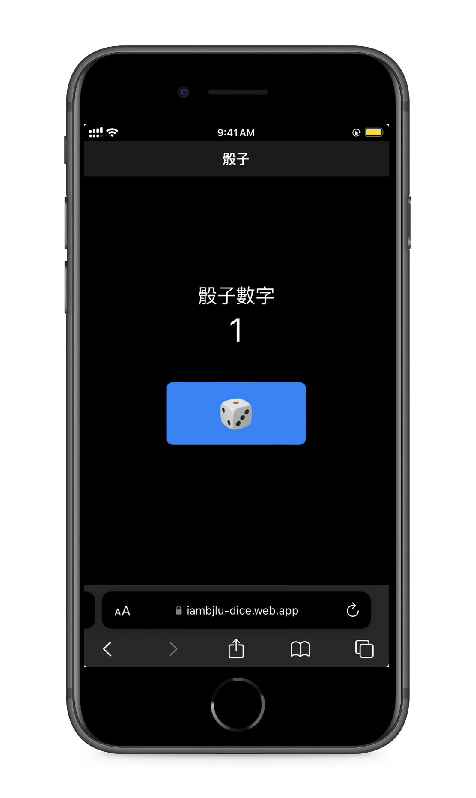
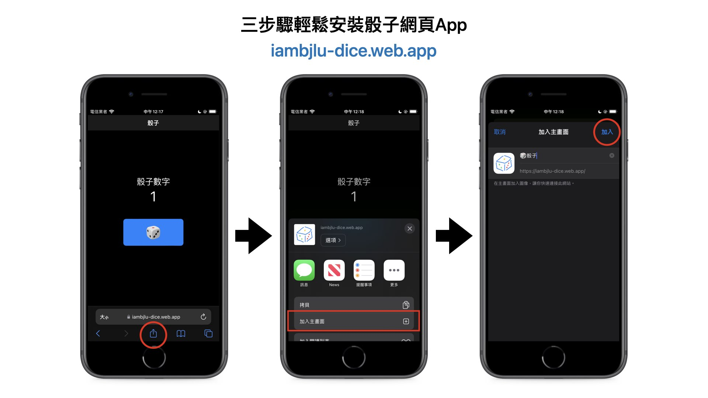

# 骰子
選擇困難終結者 
<image src="web/icons/Icon-192.png" /> 

它只是個Side Project，練手Dart語言，同時解決自己和周圍的人的選擇困難 
所以可能有些細節改法較為粗糙或是看起來預設

### 支援平台：
Apple平台可以自行編譯或使用<a href="#網頁版">網頁版</a>、<a href="#安裝在手機上">PWA網頁App</a> 

- <a href="#網頁版">網頁</a> 
- <a href="#安裝在手機上">PWA網頁App</a> 
- <a href="https://github.com/iambjlu/iambjlu-dice/releases">Android</a> 
- <a href="https://github.com/iambjlu/iambjlu-dice/releases">Windows</a> 
- iOS 
- iPadOS 
- macOS 
- <a href="https://github.com/iambjlu/iambjlu-dice/releases">Linux</a>  

# <a href="https://iambjlu-dice.web.app">網頁版</a>
<a href="https://iambjlu-dice.web.app">iambjlu-dice.web.app</a>

## 示意畫面

  

## 安裝在手機上

