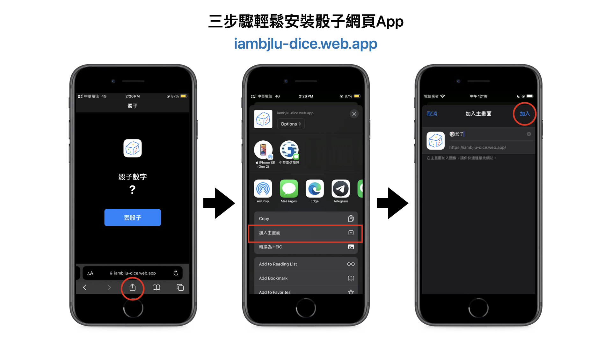

# 骰子
選擇困難終結者 
<image src="web/icons/Icon-192.png" /> 

它只是個Side Project，練手Dart語言，同時解決自己和周圍的人的選擇困難 
所以可能有些細節改法較為粗糙或是看起來預設

### 支援平台：
iOS SDK的平台可以自行編譯或使用<a href="#網頁版">網頁版</a>、<a href="#安裝在手機上">PWA網頁App</a> 

- <a href="https://iambjlu-dice.web.app">網頁</a> 
- <a href="#PWA網頁App安裝">PWA網頁App</a> 
- iOS 
- iPadOS 
- visionOS (iOS SDK) 
- <a href="https://github.com/iambjlu/iambjlu-dice/releases">macOS</a> 
- <a href="https://github.com/iambjlu/iambjlu-dice/releases">Android</a> 
- <a href="https://github.com/iambjlu/iambjlu-dice/releases">Windows</a> 
- <a href="https://github.com/iambjlu/iambjlu-dice/releases">Linux</a>  

## 示意畫面
.png)
  

# PWA網頁App安裝
需要先前往 <a href="https://iambjlu-dice.web.app">iambjlu-dice.web.app</a> 
以Safari (行動裝置)為例：

 
### 其他主流瀏覽器官方說明文件
<a href="https://support.apple.com/zh-tw/104996">Safari (電腦)</a> 
<a href="https://learn.microsoft.com/zh-tw/microsoft-edge/progressive-web-apps-chromium/ux">Microsoft Edge (電腦、行動裝置)</a> 
<a href="https://support.google.com/chrome/answer/9658361">Google Chrome (電腦、行動裝置)</a> 
  
# 備註
完全免費，不收集使用者資料，沒有內置廣告。 
上方說明的螢幕快照可能與與最新版App和網頁不符，請以實際使用為主，謝謝。